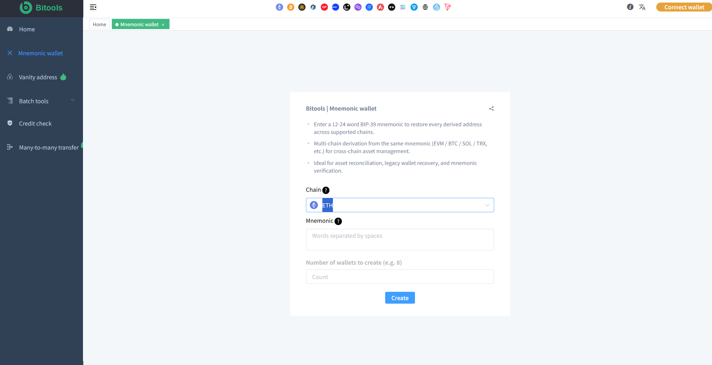

# Mnemonic Wallet

**Bitools | Mnemonic Wallet — Multi-Chain BIP-39 Address Derivation & Recovery Tool**

---

## 📖 Overview

**Bitools Mnemonic Wallet** allows you to enter a 12-24 word BIP-39 mnemonic and instantly restore every derived address across all supported chains.

It performs **multi-chain derivation from the same mnemonic** (EVM / BTC / SOL / TRX and more), making it ideal for:

- Cross-chain asset management
- Asset reconciliation
- Legacy wallet recovery
- Mnemonic verification

One mnemonic → All your addresses on every major chain.

---

## ✨ Key Features

- 🔑 **BIP-39 Mnemonic Support** — Compatible with 12 / 15 / 18 / 21 / 24 word mnemonics
- 🌐 **Multi-Chain Derivation** — Derive addresses for EVM chains, Bitcoin, Solana, TRON and more from a single mnemonic
- 📦 **Complete Address Restoration** — Restore every derived address across supported chains
- 🔍 **Mnemonic Verification** — Quickly verify if a mnemonic is valid and view all associated addresses
- 💼 **Asset Reconciliation** — Perfect for checking balances and assets scattered across multiple chains
- 🔄 **Legacy Wallet Recovery** — Recover old wallets and find forgotten addresses
- 🛡️ **Secure & Local** — Designed for privacy-conscious users

---

## 🔗 Supported Chains

| Category       | Chains                                      |
|----------------|---------------------------------------------|
| **EVM**        | Ethereum, BNB Chain, Base, Arbitrum, etc.   |
| **Bitcoin**    | BTC (Legacy, SegWit, Taproot)               |
| **Solana**     | SOL                                         |
| **TRON**       | TRX                                         |
| **More**       | Continuously expanding                      |

---

## 🚀 Use Cases

- Recover a wallet when you only have the mnemonic
- Check all addresses derived from one seed phrase
- Reconcile assets across Ethereum, Solana, TRON, Bitcoin and L2s
- Verify the correctness of a BIP-39 mnemonic
- Manage multi-chain wallets from a single seed

---

## 📸 Screenshots

  
   
  <em>Multi-Chain Mnemonic Derivation</em>

---

## 🛠️ How It Works

1. Enter your 12-24 word BIP-39 mnemonic
2. Select derivation paths / chains
3. Instantly get all derived addresses across supported networks
4. Use the addresses for balance checking, recovery or asset management

---

## 🌟 Why Bitools Mnemonic Wallet?

Most tools only support one chain.  
Bitools gives you **true multi-chain derivation** from a single mnemonic, helping you discover and manage every address that belongs to your seed phrase.

---

## 📦 Related Tools

- [Solana Tools](https://github.com/xBitools/solana-tools)
- [TRX Tools](https://github.com/xBitools/trx-tools)
- [ETH Tools](https://github.com/xBitools/eth-tools)
- [ARB Tools](https://github.com/xBitools/arb-tools)
- [BNB Tools](https://github.com/xBitools/bnb-tools)
- [Base Tools](https://github.com/xBitools/base-tools)
- [Main Bitools](https://github.com/xBitools/bitools)

---

## 🌐 Official Website

**[https://bitools.pro](https://bitools.pro)**

---

## 📄 License

MIT License

---

## About

Bitools Mnemonic Wallet — Enter a 12-24 word BIP-39 mnemonic to restore every derived address across supported chains.  
Multi-chain derivation (EVM / BTC / SOL / TRX) for cross-chain asset management, wallet recovery and mnemonic verification.

## Documentation

- [BIP-39 Mnemonic](docs/bip39-mnemonic.md)
- [Multi-Chain Derivation](docs/multi-chain-derivation.md)
- [Wallet Recovery](docs/wallet-recovery.md)
- [Address Derivation](docs/address-derivation.md)
- [Supported Chains](docs/supported-chains.md)
- [Asset Reconciliation](docs/asset-reconciliation.md)
- [Mnemonic Verification](docs/mnemonic-verification.md)
- [Security](docs/security.md)
